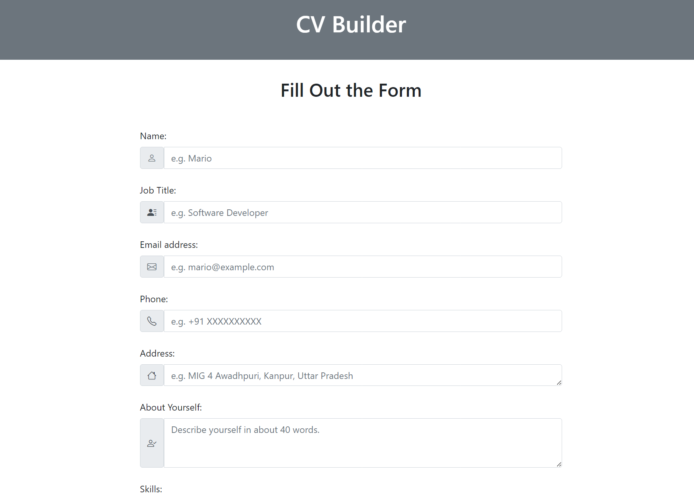
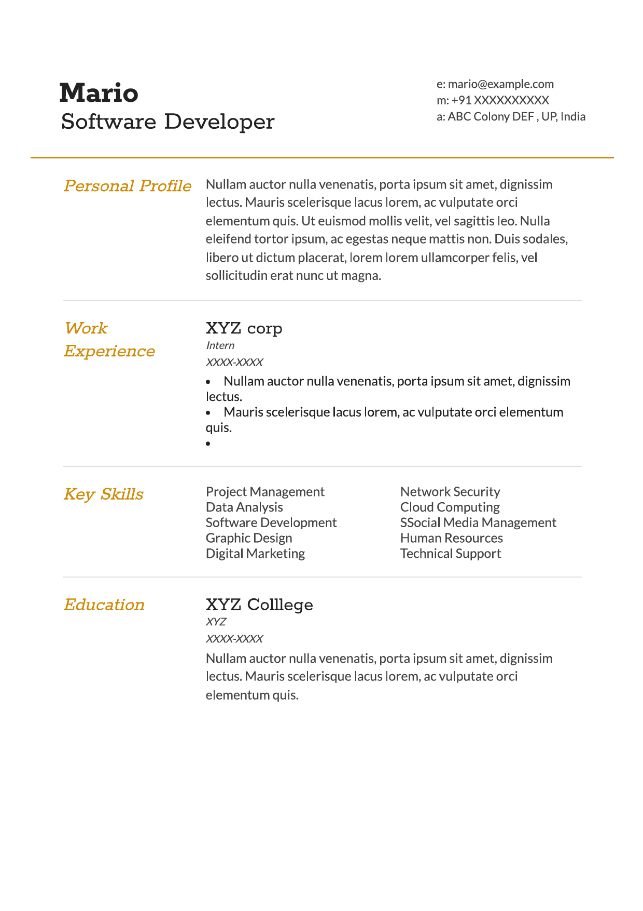

# Flask Application To Generate CVs

A simple flaks application that let you submit your info using a HTML form an when you submit your info it generates a CV for you.

## Table of Contents

- [Deployment](#deployment)
- [Demo](#demo)
  - [Preview of Submission Form](#preview-of-submission-form)
  - [Preview of the CV Generated](#preview-of-the-cv-generated)
- [Features](#features)
- [Tech Stack](#tech-stack)
- [Files](#files)
  - [Root Directory](#root-directory)
  - [Static](#static)
  - [Templates](#templates)
- [Acknowledgements](#acknowledgements)
- [Authors](#authors)

## Deployment

To deploy this project run

```bash
  flask run
```


# Demo
### [YouTube Video](https://youtu.be/sShejxeDbRI?si=21i-R1E5fmnNVyaf)

## Preview of submission form


## Preview of the CV generated

## Features

This CV generator application boasts several user-friendly features:

- **Dynamic Education and Work Experience Fields:**
   - Users can easily add more education and work experience sections by clicking the "Add Education" or "Add Work" buttons. JavaScript handles the dynamic addition of new fields to the form.

- **Skill Entry with Commas:**
   - Enter your skills as a comma-separated list (e.g., `xyz, abc, etc.`). This format simplifies the creation of a clear skills section in the generated CV.

- **Point-Wise Work Experience:**
   - Describe your work experience in detail by entering each point of responsibility or accomplishment on a new line. This approach ensures well-structured and readable details on your CV.

- **Social Media Links:**
   - The home page provides designated areas for you to include links to your social media profiles (e.g., LinkedIn, GitHub).

- **Responsive Design:**
   - The application adapts seamlessly to different screen sizes and devices, ensuring a positive user experience on desktops, tablets, and smartphones.


## Tech Stack

This project leverages the following technologies:

- **Client-Side:**
    - HTML: Provides the structure and content of the web pages.
    - CSS: Defines the visual styles and layout of the web pages.
    - JavaScript: Enables dynamic behavior and interaction on the client-side (web browser).
    - Bootstrap: webapp uses extensive bootstrap to style the home page.

- **Server-Side:**
    - Flask: A lightweight and flexible Python web framework used to handle user interaction with the form, process form data, and generate the CV.

### Project Structure

The project's code and resources are organized into the following directories:

**Root Directory (`app.py`):**

- `app.py`: Contains the core Flask application logic, handling form submissions and rendering the CV page.

**`static` Folder:**

- `cv.css`: Defines the styles used to format the generated CV.
- `style.css`: Controls the visual appearance of the home page (form) with user-submitted information.
- `script.js`: Implements the JavaScript code to dynamically add education and work experience fields.

**`templates` Folder:**

- `index.html`: The HTML template for the home page where users fill out the CV form.
- `cv.html`: The HTML template used to build the structure and layout of the generated CV.
### Acknowledgements

 - [CV template By Thomas Hardy](https://web.archive.org/web/20170915163637/http://www.thomashardy.me.uk/free-responsive-html-css3-cv-template)


### Authors

- [@sattyaaa](https://github.com/sattyaaa)


## Appendix

Ensure you have Flask installed and the virtual environment set up before running the application.

